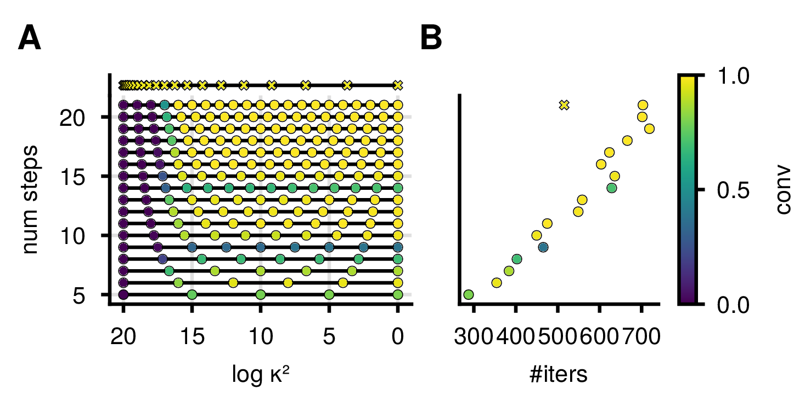

# rebuttal_fenrir_diff_temp

w.o. early stopping
| model | conv | mean_iter +/- std_iter |
|-------|------|-----------------------|
| PD    | 1.00 | 303.89 +/- 12.43       |
| LV_2  | 0.77 | 411.18 +/- 151.25      |
| LV_4  | 0.43 | 727.15 +/- 482.93      |
| HH    | 1.00 | 696.22 +/- 78.10       |

w. early stopping
| model | conv | mean_iter +/- std_iter |
|-------|------|-----------------------|
| PD    | 1.00 | 92.21 +/- 0.95         |
| LV_2  | 0.79 | 132.43 +/- 31.01       |
| LV_4  | 0.44 | 292.05 +/- 139.98      |
| HH    | 0.96 | 197.81 +/- 40.38       |
